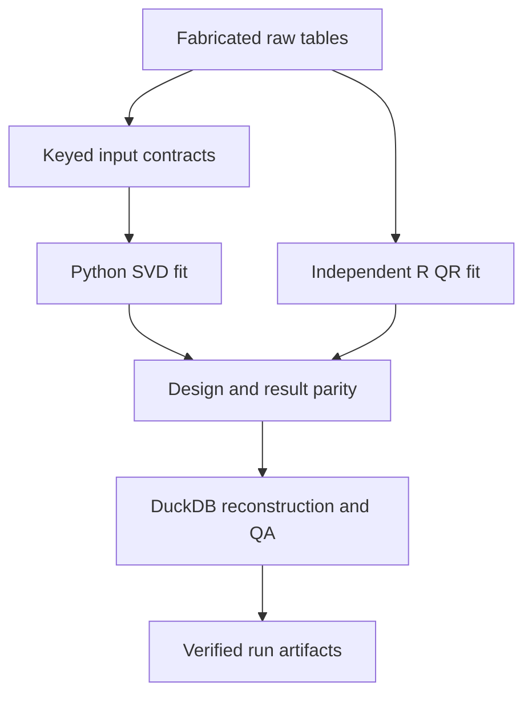

# Who Should Navigate the State? — Research Engineering Demonstration

Public engineering companion to **Who Should Navigate the State? Administrative Burden, Navigation Responsibility, and the Organizational Allocation of State Complexity**.

This repository demonstrates the engineering patterns used around the private scientific project without redistributing restricted survey records, unpublished manuscript material, accepted empirical coefficients, or private scientific artifacts.

## What this public repository demonstrates

The statistical upgrade adds an independently fitted Python/R regression demonstration alongside the original weighted-summary warehouse and dashboard.

| Capability | Executable evidence |
|---|---|
| Statistical validation | Python SVD and base-R QR weighted least squares; full coefficients, predictions, residuals, standard errors, and covariance comparison |
| Feature integrity | Ordered feature contract, fixed reference category, explicit interaction, rank and condition gates, frozen design verification |
| Weight integrity | Separate weight table, exact keyed joins, finite positive weights, recorded normalization, scale-invariance tests |
| Cluster conventions | PSU-cluster CR1 and separately defined stratum-centered score covariance; no lonely-PSU fallback |
| SQL quality | Independent feature/weight reconstruction and result reconciliation in DuckDB, plus the original relational warehouse |
| Reproducibility | Required R execution, staged results, process lock, source/artifact hashes, CI and Docker commands |

See [the local validation record](docs/statistical_validation_record.md) and [CV evidence](docs/cv_evidence.md).

## Architecture



## Synthetic data only

All tracked records in `data/synthetic/` are generated specifically for this public repository. They are not samples, subsets, perturbations, or transformations of the private research data.

The original demonstration fabricates 192 encounters. The statistical demonstration separately fabricates 288 continuous-index observations, their weights, and a registry containing 24 PSUs across six strata. Its generic fields and values are not a release of the private scientific variable dictionary.

Weights are **fabricated relative analysis weights**, not survey inclusion probabilities, population expansion factors, or frequency counts. The two covariance conventions are fully stated in [cross-language validation](docs/cross_language_validation.md). They do not establish the paper's canonical complex-survey estimator.

## Quick start

```bash
python3 -m pip install -r requirements.txt
# Install base R so Rscript is on PATH (or use the Docker command below).
./run_all_demos.sh
```

Both demos require `Rscript`; a missing runtime fails the run. The combined command runs both pipelines and their tests. The original outputs remain in `outputs/`; the new statistical artifacts are in `outputs/statistics/` and include both languages' design matrices and results, parity/SQL reports, a source manifest, and a hash receipt.

Run the statistical pipeline or verify a completed artifact set independently:

```bash
python3 -m stat_validation.pipeline
python3 -m stat_validation.pipeline --verify-only
docker build -t state-navigation-engineering .
docker run --rm state-navigation-engineering
```

Run tests with:

```bash
python3 -m pytest -q tests tests_stats
```

Local validation passed **94 tests**, **38 SQL checks** (15 original + 23 statistical), and **3,586 statistical Python/R numeric comparisons**. Docker execution and GitHub Actions status are separate from those local results; see [reproducibility](docs/reproducibility.md).

## Public / private boundary

### Public here

- synthetic inputs
- generic validation logic
- generic weighted analytics
- SQL/DuckDB engineering
- R/Python parity demonstration
- testing, CI, Docker, reporting, documentation

### Kept private

- restricted source microdata
- private constructed analytical records
- original survey variable mappings
- exact accepted empirical specifications
- accepted coefficients and covariance matrices
- manuscript and supplement
- private provenance and execution artifacts
- journal-review material

## Scientific boundary

This repository is an **engineering demonstration**. Synthetic results are illustrative only and must not be interpreted as findings from the paper. It does not establish causal effects, population estimates, administrative outcomes, lawful closure, or any result from the private scientific analysis.

## Authorship

Copyright © Mahfuzur Rahman. See `COPYRIGHT.md`.

No open-source license is granted by this repository unless a separate license file is added later.
